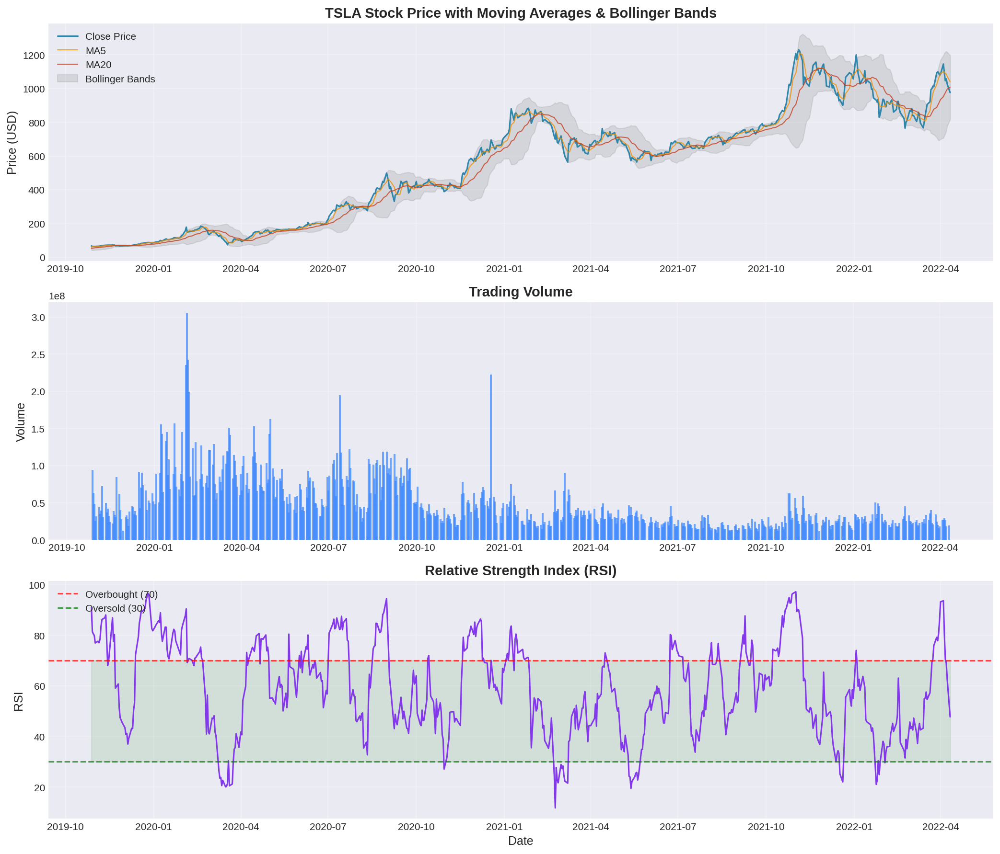
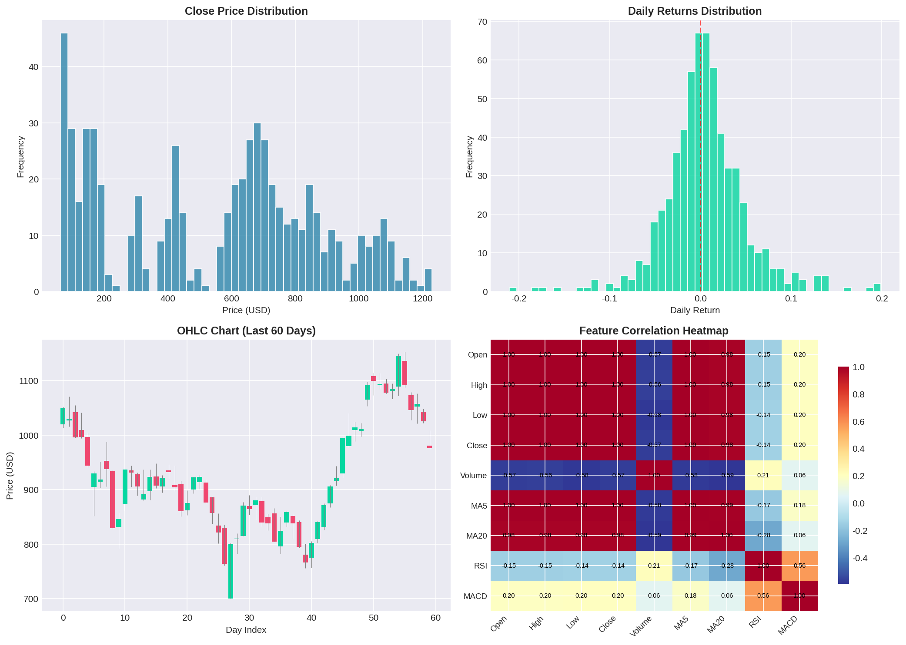
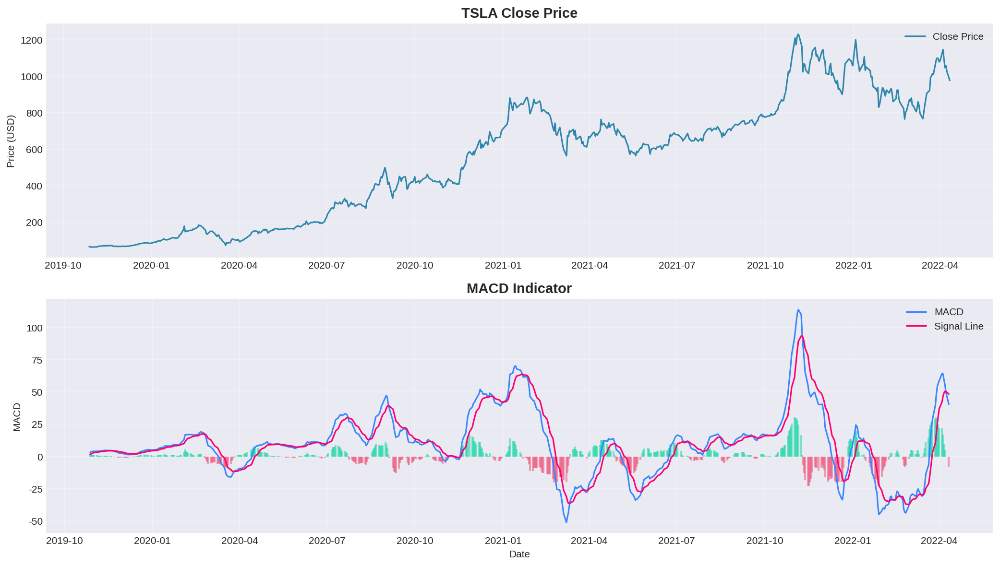
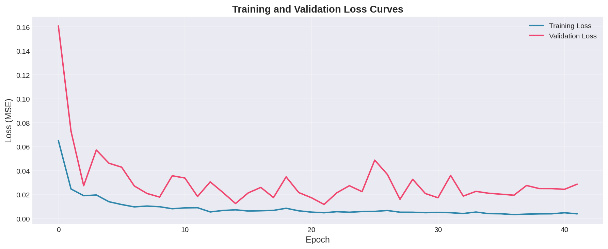
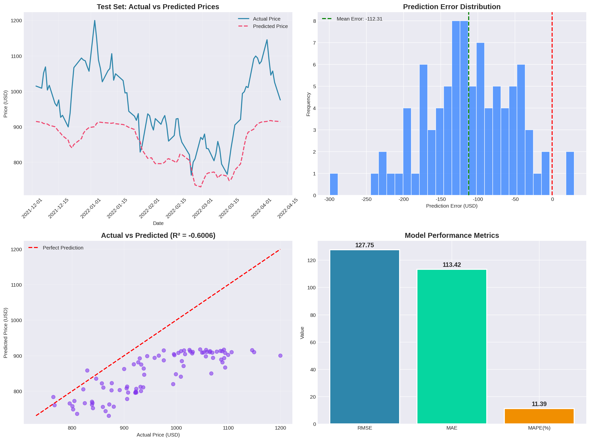
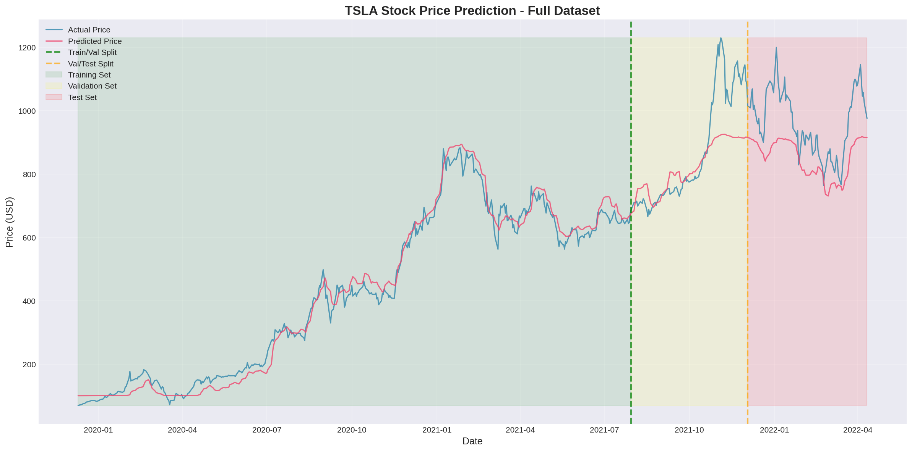
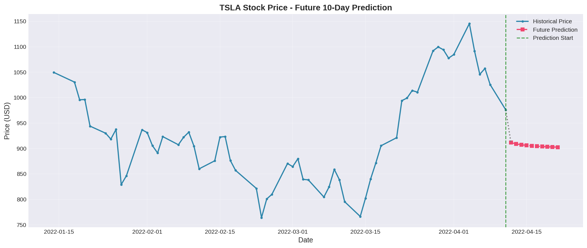

# TSLA Stock Price Prediction

## LSTM-Transformer Hybrid Deep Learning Model

[](https://www.python.org/downloads/)
[](https://pytorch.org/)
[](LICENSE)

A comprehensive stock price prediction project using a hybrid LSTM-Transformer architecture. This project demonstrates the application of deep learning techniques in financial time series forecasting.

---

## 📋 Table of Contents

- [Overview](#overview)
- [Features](#features)
- [Model Architecture](#model-architecture)
- [Project Structure](#project-structure)
- [Installation](#installation)
- [Usage](#usage)
- [Results](#results)
- [Visualizations](#visualizations)
- [Technical Indicators](#technical-indicators)
- [Contributing](#contributing)
- [Disclaimer](#disclaimer)

---

## 🎯 Overview

This project implements a hybrid deep learning model that combines **Long Short-Term Memory (LSTM)** networks with **Transformer** architecture for predicting Tesla (TSLA) stock prices. The model leverages:

- **LSTM**: Captures sequential dependencies and long-term temporal patterns
- **Transformer**: Uses self-attention mechanism to learn complex relationships between different time steps
- **Technical Indicators**: Incorporates Moving Averages, RSI, MACD, and Bollinger Bands as features

### Key Highlights

- 📊 Comprehensive data analysis and visualization
- 🧠 State-of-the-art hybrid neural network architecture
- 📈 Multiple technical indicators for feature engineering
- 📉 Detailed model evaluation with various metrics
- 🔮 Future price prediction capability

---

## ✨ Features

### Data Processing
- Automatic loading and preprocessing of stock data
- Feature engineering with 11 technical indicators
- Min-Max normalization for optimal model training
- Sliding window approach for sequence generation

### Model Capabilities
- Bidirectional LSTM for enhanced temporal understanding
- Multi-head self-attention mechanism
- Positional encoding for sequence position information
- Dropout regularization to prevent overfitting
- Early stopping with learning rate scheduling

### Visualization
- Stock price trends with moving averages
- Trading volume analysis
- RSI and MACD technical analysis charts
- Training/validation loss curves
- Prediction vs actual comparison plots
- Future price prediction visualization

---

## 🏗️ Model Architecture

```
Input (B × 30 × 11)
       ↓
┌──────────────────┐
│ Input Projection │  Linear: 11 → 128
└──────────────────┘
       ↓
┌──────────────────┐
│ Bidirectional    │  2 layers, hidden=128
│     LSTM         │  Output: 256
└──────────────────┘
       ↓
┌──────────────────┐
│ LSTM Projection  │  Linear: 256 → 128
└──────────────────┘
       ↓
┌──────────────────┐
│   Positional     │  Sinusoidal encoding
│    Encoding      │
└──────────────────┘
       ↓
┌──────────────────┐
│   Transformer    │  2 layers, 4 heads
│    Encoder       │  FFN: 128 → 512 → 128
└──────────────────┘
       ↓
┌──────────────────┐
│   Output MLP     │  128 → 64 → 32 → 1
└──────────────────┘
       ↓
Output (B × 1)
```

**Total Parameters**: ~1.1 Million

---

## 📁 Project Structure

```
pbl_lstm/
├── TSLA.csv                      # Raw stock data
├── requirements.txt              # Python dependencies
├── README.md                     # This file
│
├── tsla_stock_prediction.py      # Main script (Chinese comments)
├── tsla_stock_prediction_en.py   # Main script (English comments)
│
├── PROJECT_REPORT.md             # Detailed report (Chinese)
├── PROJECT_REPORT_EN.md          # Detailed report (English)
│
└── output/                       # Generated outputs
    ├── 01_stock_overview.png     # Stock price overview
    ├── 02_data_analysis.png      # Data distribution analysis
    ├── 03_macd_analysis.png      # MACD indicator analysis
    ├── 04_training_curves.png    # Training loss curves
    ├── 05_prediction_results.png # Test set predictions
    ├── 06_full_prediction.png    # Full dataset predictions
    ├── 07_future_prediction.png  # Future predictions
    ├── best_model.pth            # Trained model weights
    ├── evaluation_metrics.csv    # Model performance metrics
    ├── prediction_results.csv    # Detailed predictions
    └── future_predictions.csv    # Future price forecasts
```

---

## 🚀 Installation

### Prerequisites

- Python 3.10 or higher
- CUDA-capable GPU (optional, but recommended)

### Setup

1. **Clone the repository**
```bash
git clone <repository-url>
cd pbl_lstm
```

2. **Install dependencies**
```bash
pip install -r requirements.txt
```

### Dependencies

```
numpy==1.24.3
pandas==2.0.3
matplotlib==3.7.2
seaborn==0.12.2
scikit-learn==1.3.0
torch==2.0.1
tqdm==4.65.0
```

---

## 💻 Usage

### Running the Main Script

```bash
# Run with English comments version
python tsla_stock_prediction_en.py

# Or run with Chinese comments version
python tsla_stock_prediction.py
```

### Expected Output

The script will:
1. Load and preprocess the TSLA stock data
2. Generate visualization charts
3. Train the LSTM-Transformer model
4. Evaluate model performance
5. Generate future predictions
6. Save all outputs to the `output/` directory

### Training Progress

```
============================================================
1. Data Loading and Preprocessing
============================================================
Dataset shape: (639, 7)
Time range: 2019-09-30 to 2022-04-11
...

============================================================
5. Model Training
============================================================
Starting training (max 100 epochs)...
Training: 100%|██████████| 48/100 [00:03<00:00]
Early stopping: Validation loss hasn't improved for 20 epochs
Training completed! Best validation loss: 0.011701
```

---

## 📊 Results

### Model Performance on Test Set

| Metric | Value | Description |
|--------|-------|-------------|
| **RMSE** | $127.75 | Root Mean Square Error |
| **MAE** | $113.42 | Mean Absolute Error |
| **MAPE** | 11.39% | Mean Absolute Percentage Error |
| **R²** | -0.60 | Coefficient of Determination |

### Training Configuration

| Parameter | Value |
|-----------|-------|
| Sequence Length | 30 days |
| Batch Size | 32 |
| Learning Rate | 0.001 |
| Hidden Dimension | 128 |
| LSTM Layers | 2 (Bidirectional) |
| Transformer Layers | 2 |
| Attention Heads | 4 |
| Dropout | 0.2 |

---

## 📈 Visualizations

### Stock Price Overview


### Data Analysis


### MACD Analysis


### Training Curves


### Prediction Results


### Full Dataset Prediction


### Future Prediction


---

## 📐 Technical Indicators

The model uses the following technical indicators as input features:

| Indicator | Formula | Description |
|-----------|---------|-------------|
| **MA5** | \(\frac{1}{5}\sum_{i=0}^{4} P_{t-i}\) | 5-day Moving Average |
| **MA10** | \(\frac{1}{10}\sum_{i=0}^{9} P_{t-i}\) | 10-day Moving Average |
| **MA20** | \(\frac{1}{20}\sum_{i=0}^{19} P_{t-i}\) | 20-day Moving Average |
| **RSI** | \(100 - \frac{100}{1+RS}\) | Relative Strength Index (14-day) |
| **MACD** | \(EMA_{12} - EMA_{26}\) | Moving Average Convergence Divergence |
| **Signal** | \(EMA_9(MACD)\) | MACD Signal Line |

---

## 🔧 Customization

### Modify Model Parameters

Edit the model initialization in the script:

```python
model = LSTMTransformerModel(
    input_dim=11,           # Number of input features
    hidden_dim=128,         # Hidden layer dimension
    lstm_layers=2,          # Number of LSTM layers
    nhead=4,                # Number of attention heads
    transformer_layers=2,   # Number of transformer layers
    dropout=0.2             # Dropout rate
)
```

### Adjust Training Settings

```python
SEQ_LENGTH = 30           # Lookback window size
BATCH_SIZE = 32           # Training batch size
EPOCHS = 100              # Maximum training epochs
early_stop_patience = 20  # Early stopping patience
```

---

## 🤝 Contributing

Contributions are welcome! Please feel free to submit a Pull Request.

1. Fork the repository
2. Create your feature branch (`git checkout -b feature/AmazingFeature`)
3. Commit your changes (`git commit -m 'Add some AmazingFeature'`)
4. Push to the branch (`git push origin feature/AmazingFeature`)
5. Open a Pull Request

---

## ⚠️ Disclaimer

**IMPORTANT**: This project is for **educational and research purposes only**. 

- The predictions generated by this model **do not constitute financial advice**
- Stock market investments involve **significant risk**
- Past performance does not guarantee future results
- Always conduct your own research and consult with qualified financial advisors before making investment decisions

---

## 📄 License

This project is licensed under the MIT License - see the [LICENSE](LICENSE) file for details.

---

## 📚 References

1. Hochreiter, S., & Schmidhuber, J. (1997). Long short-term memory. *Neural Computation*, 9(8), 1735-1780.
2. Vaswani, A., et al. (2017). Attention is all you need. *NeurIPS*, 30, 5998-6008.
3. Fama, E. F. (1970). Efficient capital markets: A review of theory and empirical work. *The Journal of Finance*, 25(2), 383-417.

---

## 📞 Contact

For questions or feedback, please open an issue in this repository.

---

*Last Updated: January 2026*

